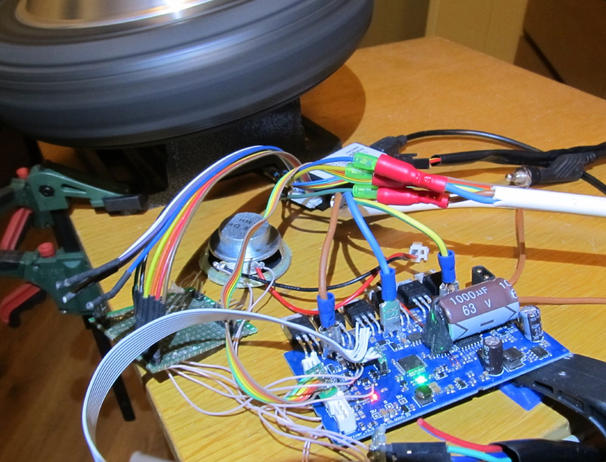
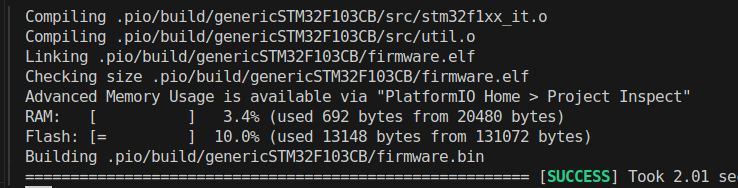
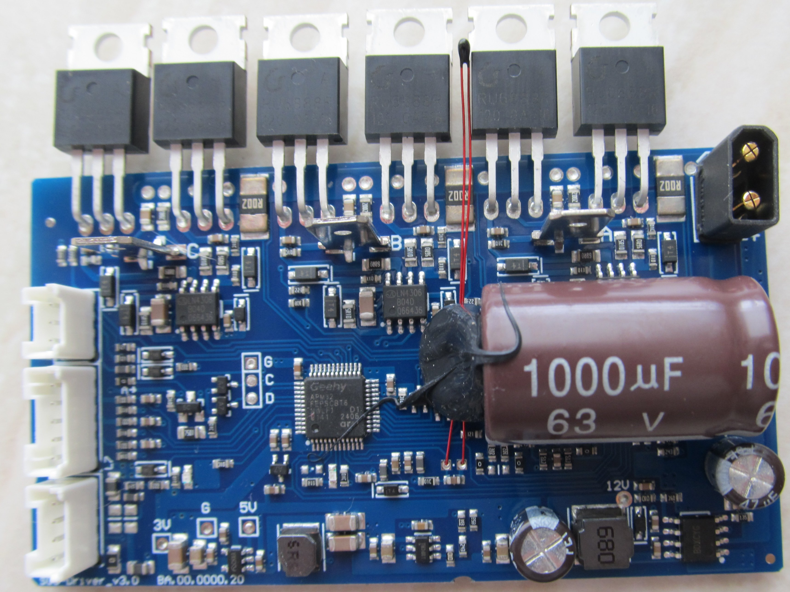
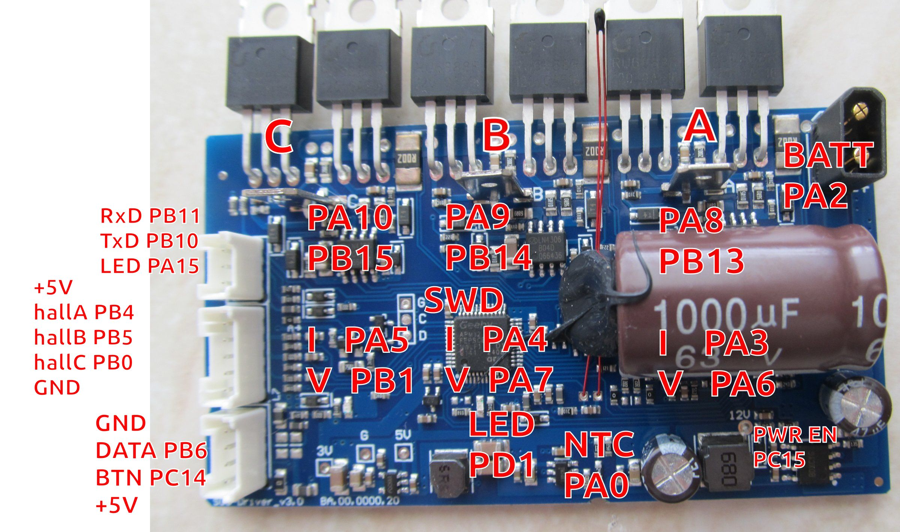
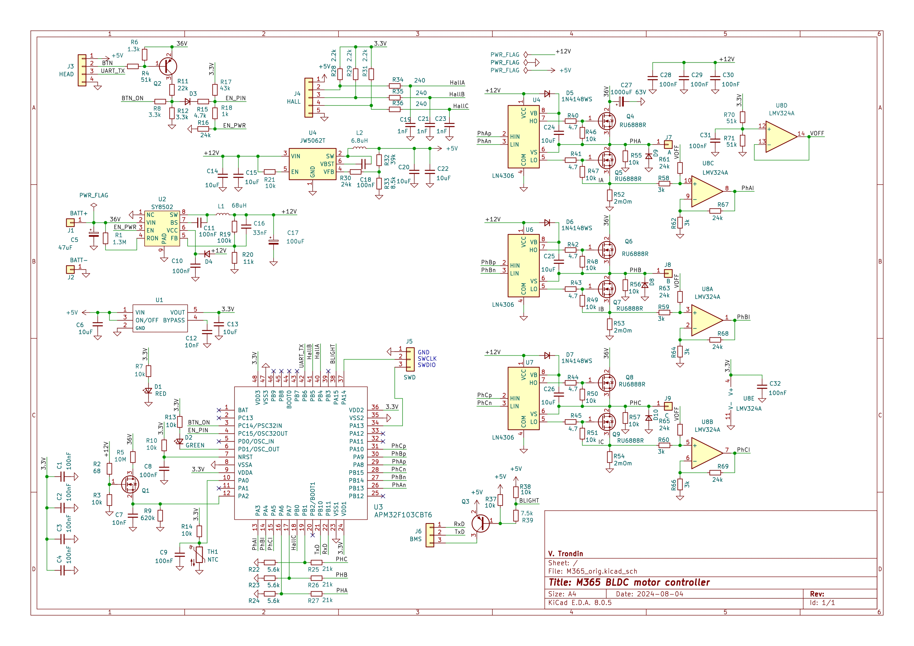

# EFeru hack FOC port for XIAOMI Mijia M365 board

This project is EFeru Hoverboard hack clone for Geehy APM32F103CBT6, comparible with STM2F103CBT6 (https://github.com/EFeru/hoverboard-firmware-hack-FOC)

Only UART control is functional.
Please check here https://github.com/EFeru/hoverboard-firmware-hack-FOC/tree/main/Arduino/hoverserial for details.

TRQ_MODE and SPD_MODE work well - it was my target.

Visual Studio code with Platformio plugin can be used.

Board view:

Pinout:

Schematic:

I am sorry about mistakes in the reversed schematic, if any :)

Disclaimer:
no guarantee, no support.

